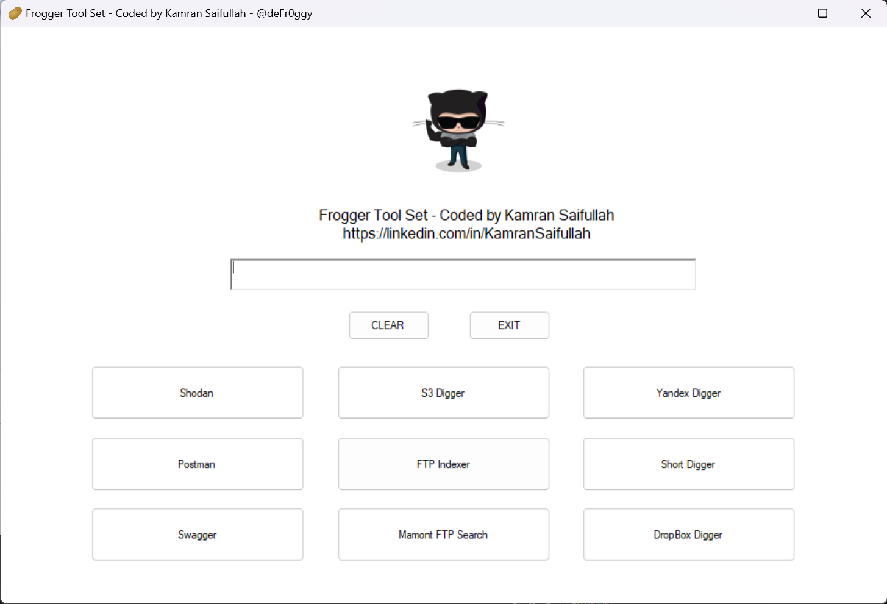

# Frogger-ToolSet

In order to learn more about C# WinForms, I though to have started working on a small project which probably is going to help myself automate some of my daily tasks, especially when it comes to searching for some information on the internet. Most of the times, i need to open a bunch of URLs and then copy paste the same information in all of them to get the results. What if we can get this done from a single page? 

Well, yes HTML and other ways are there but i personally wanted to have it as a standalone windows application without the need of anything else. All that is required is as below. 

- Windows Operating System
- .NET
- Default Browser (Chrome, Firefox, Edge)
- Need to serach for the things. 

# Usage

All you need is to provide the following in order for the tools to work properly. 

- Text you want to search for. 
- IP Address/Addresses.
- URL/URLs.
- Brain - to know what to place where and what will work with what tool.

# Tool Set

Following are the currently supported tools. 

1. Postman Search - Searching for exposed APIs.
2. Swagger Search - Searching for exposed Swagger Files. 
3. Shodan - Well, you know that! 
4. S3 Digger - Searching for exposed S3 buckets.
5. FTP Indexer - Searching for exposed FTP servers/files.
6. Mamont FTP Search - Searching for exposed GTP Servers/files
7. Yandex Digger - Searching for exposed data on Yandex.
8. Short Digger - Searching for exposed data on ShortURLs.
9. DropBox Digger - Searching for exposed data on DropBox. 

# Extra

There is a ton of garbage in the codebase itself, definitely i know, still working on this as this is just a boiler plate, i need to move a ton of data from my Final Year Project into this tool itself. It's going to be a fun GUI and many pages. Let's see how far we go on this journey. 

# Contributions

Feel free to contribute to the codebase and share ideas as they come across your mind. 

# Say Hi! 

If you want to say Hi!, you can reach out to be at the following. 

1. [LinkedIn](https://linkedin.com/in/KamranSaifullah)
2. [Twitter](https://twitter.com/deFr0ggy)